# Udacity Blockchain Developer ND
## PROJECT: Supply Chain

<br>

For this project, I created a DApp by adding functionality to a prepared smart contract
([project](https://github.com/udacity/nd1309-Project-6b-Example-Template))
and deployed it on the public Rinkeby testnet.

<br>

Description by Udacity:  
> This repository containts an Ethereum DApp that demonstrates a Supply Chain flow between a Seller and Buyer. The user story is similar to any commonly used supply chain process. A Seller can add items to the inventory system stored in the blockchain. A Buyer can purchase such items from the inventory system. Additionally a Seller can mark an item as Shipped, and similarly a Buyer can mark an item as Received.

<br>

I used the following versions to run the project:  

Ganache CLI v6.12.2 (ganache-core: 2.13.2)  
Truffle v5.3.2 (core: 5.3.2)  
Solidity v0.5.16 (solc-js)  
Node v15.14.0  
Web3.js v1.3.5

<br>

E.g., [Contract](https://rinkeby.etherscan.io/address/0x18aa26fa12f1e8626d2c8153fe5f3d2f7b93bc0a)
on the Rinkeby Network

**Transaction ID**: 0x2413434603154d4b6ac0657910bda2deb675d0bb500b63663d619c83504a2fa3  
**Contract address**: 0x18aa26fa12f1e8626d2c8153fe5f3d2f7b93bc0a

<br>

---

<br>

## Project write-up
### UML diagrams

#### Activity

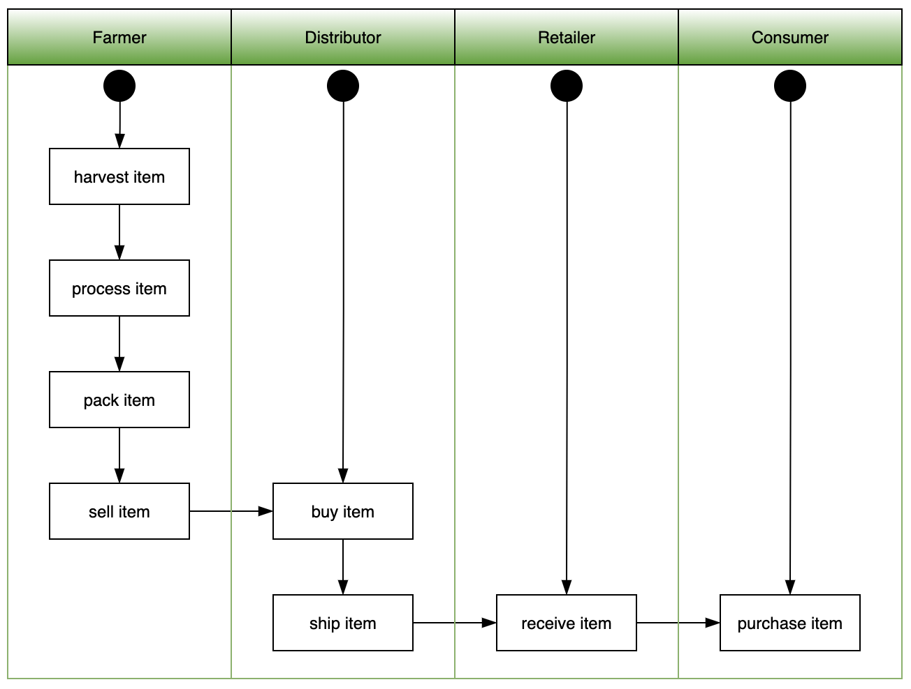

<br>

#### Sequence

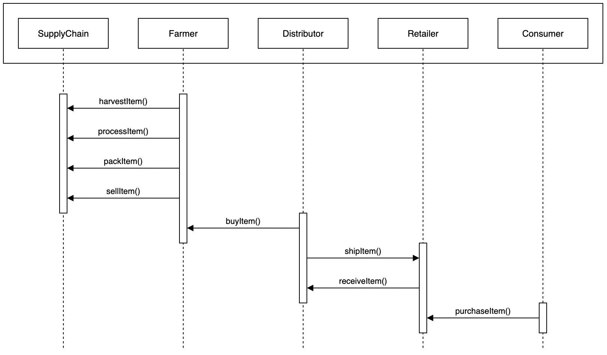

<br>

#### State

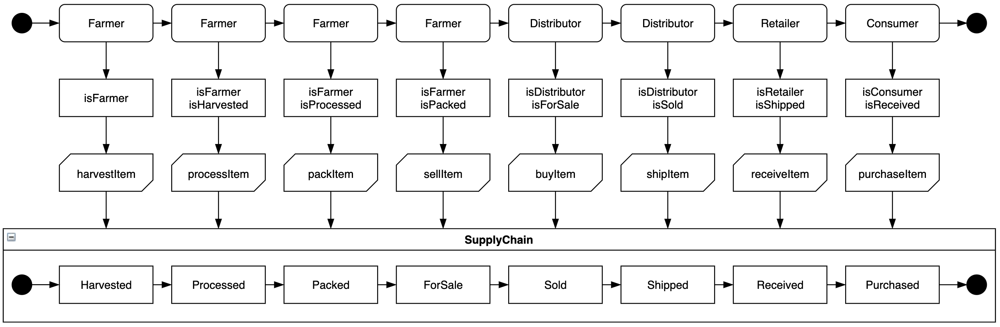

<br>

#### Classes (Data Model)

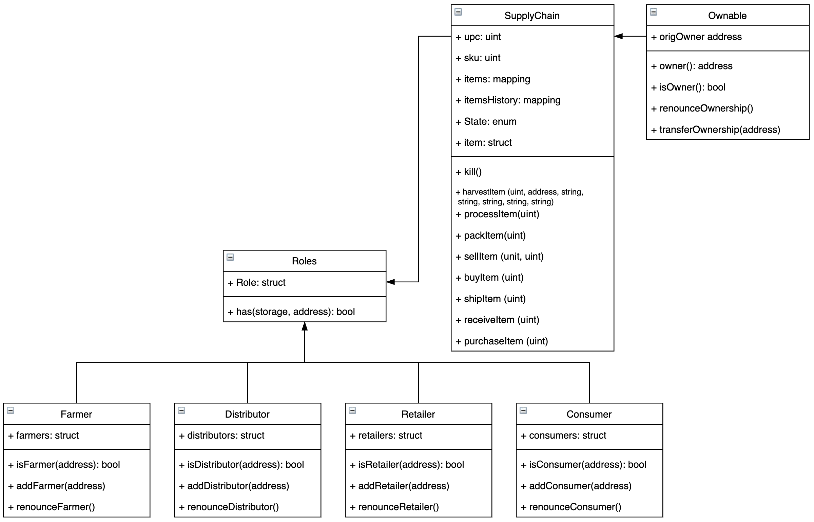

<br>

### IPFS

...

<br>

---

<br>

## Getting Started

These instructions will get you a copy of the project up and running on your local machine for development and testing purposes. See deployment for notes on how to deploy the project on a live system.

<br>

### Prerequisites

Please make sure you've already installed ganache-cli, Truffle and enabled MetaMask extension in your browser.

Here is how you check which ganache-cli and Truffle version you have installed:

```
ganache-cli --version   

Ganache CLI v6.12.2 (ganache-core: 2.13.2)
```                                                                           

```
truffle version

Truffle v5.3.2 (core: 5.3.2)  
Solidity v0.5.16 (solc-js)  
Node v15.14.0  
Web3.js v1.3.5
```

If you need to install one of the mentioned tools, follow the How-tos mentioned here:

- [How to install ganache-cli](https://github.com/trufflesuite/ganache-cli#installation)
- [How to install truffle](https://www.trufflesuite.com/truffle)
- [How to install Metamask](https://metamask.io/download.html)

<br>

#### Other mandatory packages:
```bash
# install packages
npm install --save  truffle-hdwallet-provider@1.0.17
npm install web3
```

<br>

### Installing

A step by step series of examples that tell you have to get a development env running

Clone this repository:

```
git clone https://github.com/stefanscherzer/supply_chain_project.git
```

Install all requisite npm packages (as listed in ```package.json```):

```
npm install
```

Launch Ganache:

```
ganache-cli -m "spirit supply whale amount human item harsh scare congress discover talent hamster"
```

Your terminal should look something like this:

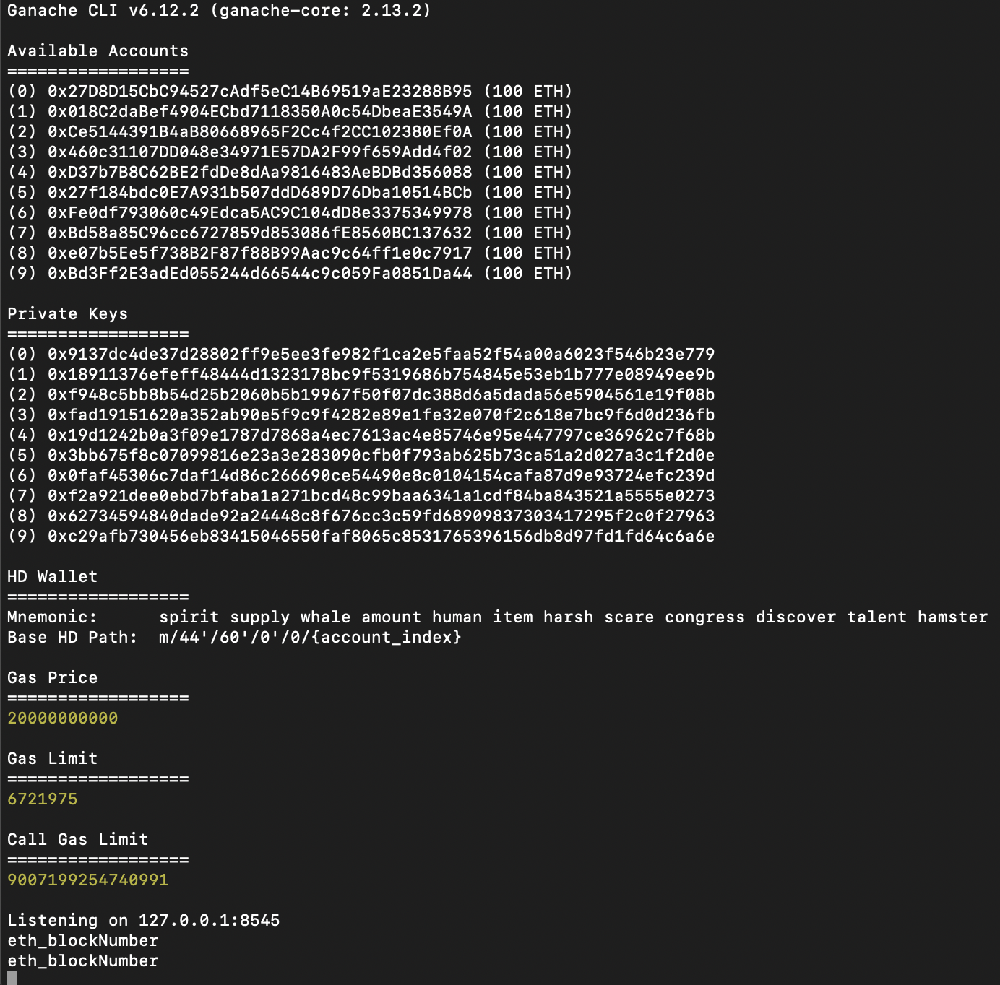

---

<br>

In a separate terminal window, Compile your smart contracts:

```
truffle compile
```

Your terminal should look something like this:

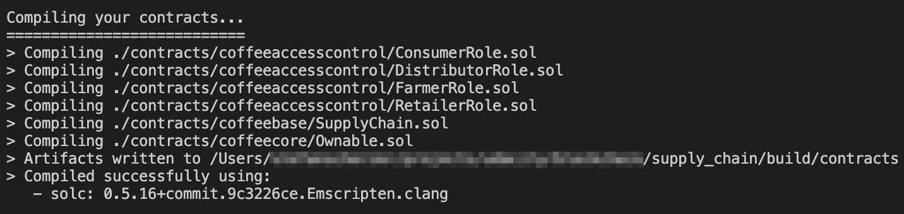

This will create the smart contract artifacts in folder ```build\contracts```.

---

<br>

Migrate smart contracts to the locally running blockchain, ganache-cli:

```
truffle migrate
```

Your terminal should look something like this:

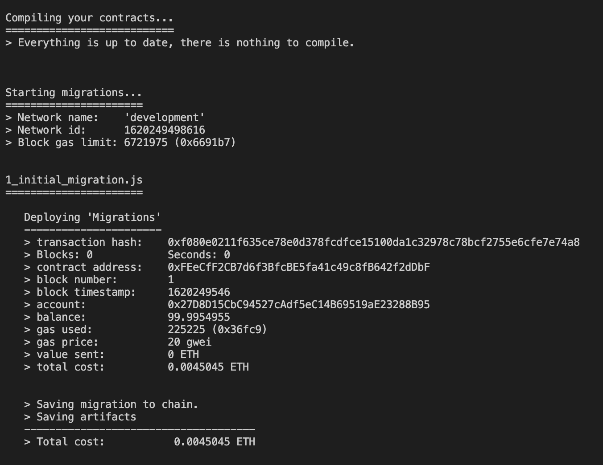  

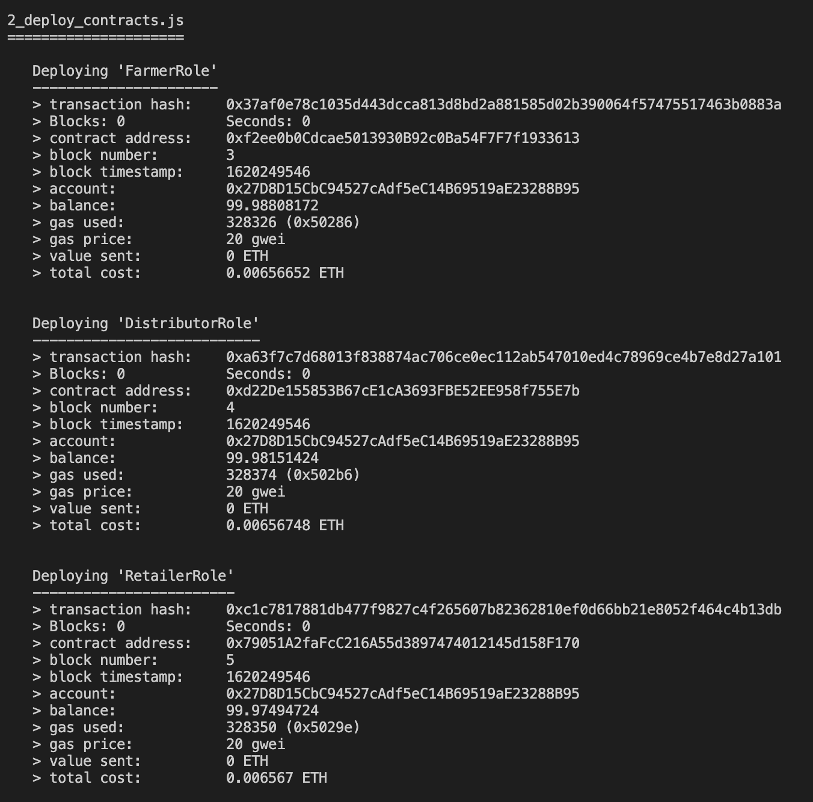  

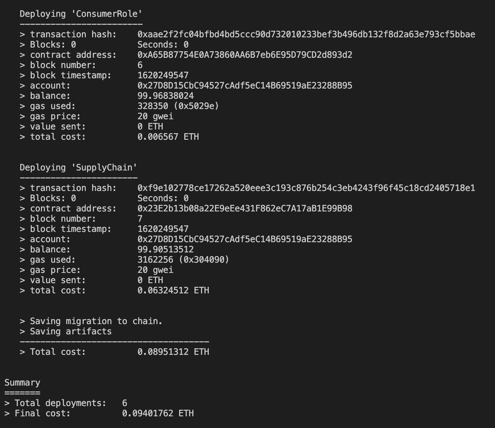

---

<br>

Test smart contracts:

```
truffle test
```

All 10 tests should pass.

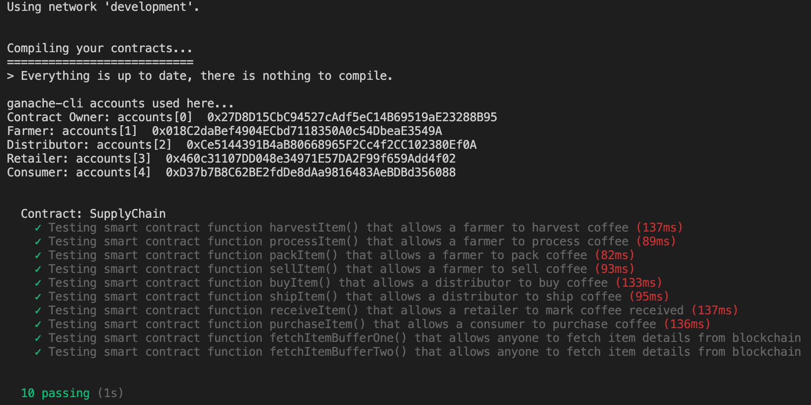

---

<br>

In a separate terminal window, launch the DApp:

```
npm run dev
```

---

<br>

### Deploy the smart contract on the Rinkeby Network

<br>

Create a `.mnemonic` and a `.infurakey` file in your root folder.<br>
The `.mnemonic` file holds your Metamask mnemonic phrase.<br>
In the `.infurakey` file you need to add your personal Infura PROJECT ID.

<br>

In a terminal window, Migrate smart contracts to the Rinkeby Network:

```
truffle migrate --reset --network rinkeby
```

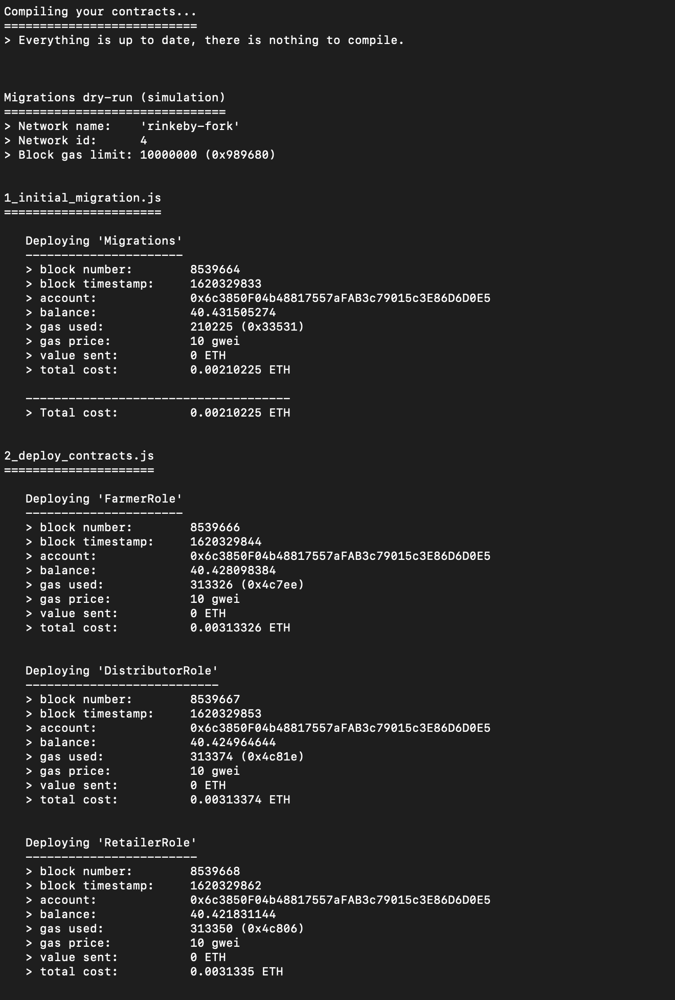  

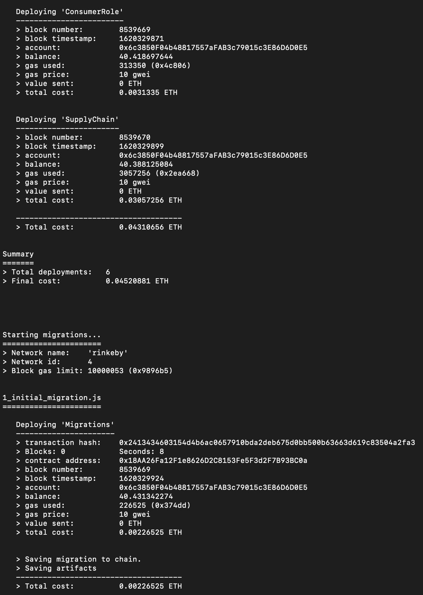  

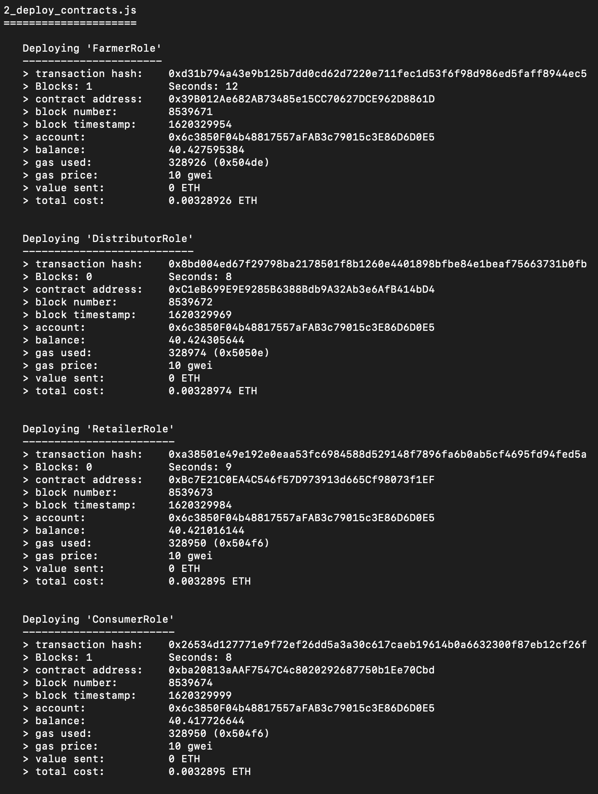  

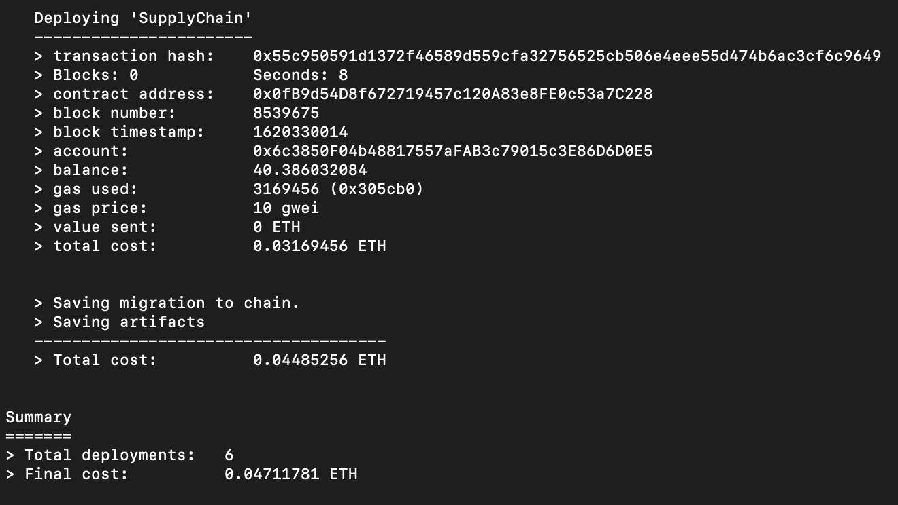


